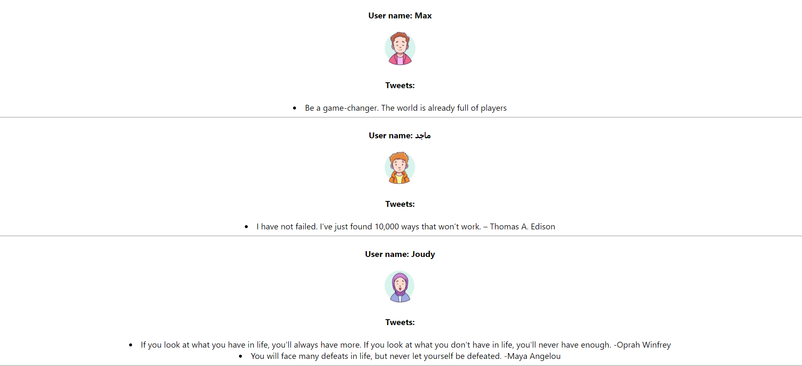

## W04D04 HW
### Twitter app
* Create a react app.
* Make Tweets Component that contain array of objects, each object will have name, image, array of Tweets.
* You should display Tweets component in App component using map.
### The output will be something similar to this:

